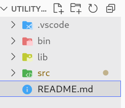
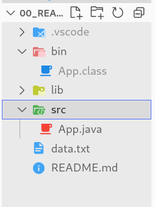

# 01.010 Classes, Packages, and Jars

## Problems you may have at the command line

* This unit will use some operations at the command line.  
  * Some IDEs have these mechanisms built-in.
    * IDEs like IntelliJ were built for Java and have these operations built in.
    * VS Code and Eclipse may require plugins or extensions for some operations.  VS Code is still somewhat immature and does not seem to have the extensions fully developed.
  * If the java /bin file is not on the PATH these commands probably will not work.  You may add the bin to your PATH variable, but the mechanisms vary by operating system.
* Try the following commands at the CLI:
  * `java --version`
  * `javac --version`
  * `jar --version`
  * `javadoc --version`
  
  ## Directory Structure

  * "Directory" and "Folder" mean the same thing.  The original name was directory, but Windows 3 introduced the term folder in Windows 3.  They also introduced the folder icon which is now ubiquitous across operating systems.
  
Directories | Directories and Contents
---|---  
 | 

  * ***Project Root*** is the home folder of the project.  Don't confuse it with the system root.
  * Most IDEs use a standard directory structure.  The typical structure includes:
    * ***src*** is where the source code is located.  It may have subdirectories
    * ***bin*** 
      * This "bin" is different than the system bin.  In both cases bin refers to the directory that contains executable files.  
      * In an IDE the bin folder is where the executable of the entire program is placed. It holds the output of the compiler
      * In the case of Java, the bin folder holds the .class files.
    * ***lib*** The lib directory holds "Library" files.  
      * These are typically modules that have been imported into the project.  
      * An example would be importing a package to read from a database.
      * In Java, these will usually be .jar files
    * ***resources*** Typically holds configuration files that are not in the root of the project.  It may also contain resources such as images 
  
  ## .class Files

  * Class files contain compiled code.
  * Java compiled code is sort of a generic assembly and machine language that is designed to run on any computer system
  * The Java Runtime Engine (JRE) converts the Java compiled code to the machine language of the computer it is operating on.
  * The `javac` command compiles the .java file and produces .class files
  * The `java` command executes the .class file

## .jar Files

* Jar files are basically .zip files contain classes.   
  *  If you unzip the jar file you will find:
     *  .class files
     *  A "manifest" that contains a list of the files.
     *  The `jar` command makes .jar files.
     *  The`jar` command may be applied to individual files, but usually it is applied to directories.  All the class files found in the directory and subdirectories are put into the resulting .jar file. 
     * The usual commend to create a jar file is

```bash
jar -cf <nameOfJarFile.jar> <directory>
```
* Technically the file may have any extension but it is almost always .jar
* You may use `jar -t &lt;filename>` to list the contents of a jar file

Jar files are important because they allow us to bring in "dependencies."  Dependencies are specialized software packages.  For example, we may use a module that lets us read from a database.

Jar files may be a fully executable program.  But it takes a bit of playing with the mainifest to indicate what the main() method should be.  Generally we let the ide do the heavy lifting for us.